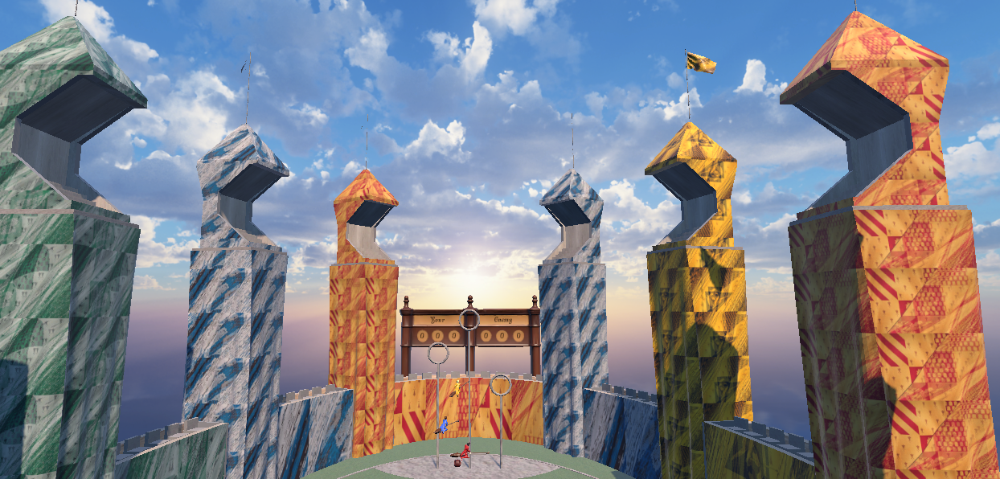
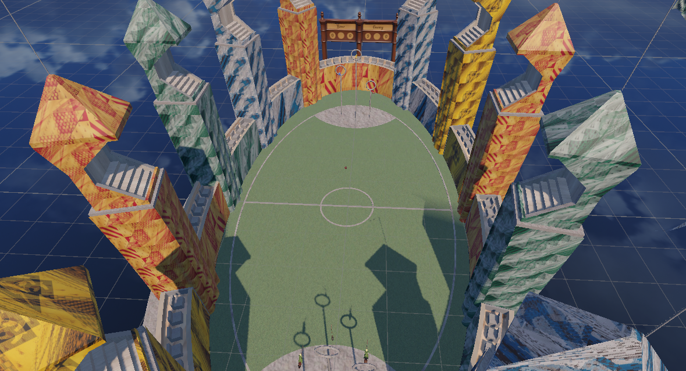
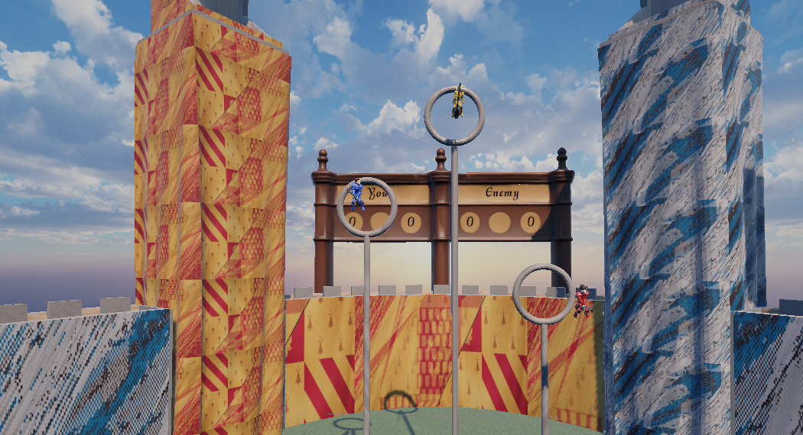

<div align="center">


# K W I D I C H

### Воздушный командный спорт в виртуальной реальности

Полёт на метле, борьба за мяч, три кольца и динамичный матч против соперников.


[Об игре](#об-игре) · [Геймплей](#геймплей) · [Управление](#управление) · [Запуск](#запуск)

</div>

---



## Об игре

**Kwidich** — VR-прототип командной спортивной игры на Unity. Игрок управляет летающей метлой, перемещается по большой фэнтезийной арене, борется за мяч и забрасывает его в кольца команды соперника.

Арена построена как полноценное игровое пространство: овальное поле окружено разноцветными башнями, трибунами и шестью воротами. Табло показывает счёт игрока и противника, а отдельные сцены отвечают за главное меню, победу и поражение.

## Галерея

<table>
<tr>
<td width="50%"></td>
<td width="50%"></td>
</tr>
<tr>
<td align="center"><sub>Планировка поля и башен арены</sub></td>
<td align="center"><sub>Ворота, игроки и игровое табло</sub></td>
</tr>
</table>

## Геймплей

| Система | Реализация |
| :--- | :--- |
| 🧹 **Полёт на метле** | Физическое движение через Rigidbody, разгон, торможение, поворот, наклон модели и удержание высоты. |
| 🏐 **Мяч** | Подбор, удержание, бросок по направлению камеры и возможность перехватить мяч у AI-соперника. |
| ⭕ **Кольца** | Гол фиксируется, когда свободный мяч проходит через триггер кольца; после гола воспроизводится звук. |
| 🧮 **Счёт матча** | Менеджер ведёт счёт игрока и противника. Победа или поражение наступает при достижении 6 очков. |
| 🤖 **Соперники** | В проекте есть AI-игроки и логика владения мячом, с которой взаимодействует игрок. |
| 🎧 **Атмосфера** | Панорамное небо, звуковой микшер, голоса NPC и ресурсы интеграции bHaptics. |

## Управление

Проект использует нестандартную схему ввода через **Logitech G29**:

- руль задаёт направление полёта;
- педали газа и тормоза управляют скоростью вперёд и назад;
- переключатель используется для подъёма и снижения;
- педаль сцепления выполняет бросок мяча;
- рядом с соперником игрок может перехватить мяч после отката способности.

Параметры скорости, ускорения, чувствительности, высоты и перехвата вынесены в Inspector и настраиваются без изменения кода.

## Технологии

**Unity 6 · C# · XR Interaction Toolkit · OpenXR · Unity Input System · TextMesh Pro · bHaptics**

Основная версия редактора: **Unity 6000.2.9f1**.

## Сцены

| Сцена | Назначение |
| :--- | :--- |
| **Assets/Scenes/MainMenu.unity** | Главное меню |
| **Assets/Scenes/QwidSpeed.unity** | Основной матч |
| **Assets/Scenes/WinScene.unity** | Экран победы |
| **Assets/Scenes/LoseScene.unity** | Экран поражения |

## Запуск

1. Установите **Unity Hub** и **Unity Editor 6000.2.9f1**.
2. Клонируйте репозиторий:

   ```bash
   git clone https://github.com/TAlleks/kwidich.git
   ```

3. Добавьте папку проекта через **Unity Hub → Add project from disk**.
4. Дождитесь импорта ресурсов и восстановления пакетов.
5. Откройте **Assets/Scenes/MainMenu.unity** и запустите Play Mode.
6. Для полного управления подключите и настройте Logitech G29, а для VR — выбранный OpenXR/Oculus-провайдер.

## Структура

| Путь | Содержимое |
| :--- | :--- |
| [Assets/Scripts](Assets/Scripts) | Полёт, счёт, кольца, мяч, меню и команды |
| [Assets/Scenes](Assets/Scenes) | Игровая сцена, меню, победа и поражение |
| [Assets/XR](Assets/XR) · [Assets/XRI](Assets/XRI) | XR-настройки и ресурсы взаимодействия |
| [Assets/Bhaptics](Assets/Bhaptics) | Ресурсы тактильной интеграции |
| [ProjectSettings](ProjectSettings) | Конфигурация Unity и порядок сцен |

---

<div align="center">

**Подними метлу. Забери мяч. Пройди сквозь кольцо.**

[Профиль TAlleks](https://github.com/TAlleks) · [Исходный код](https://github.com/TAlleks/kwidich)

</div>
